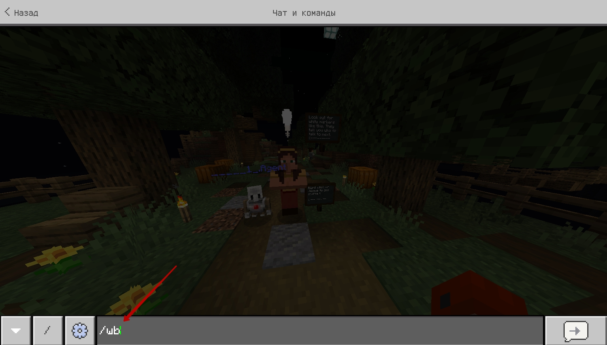
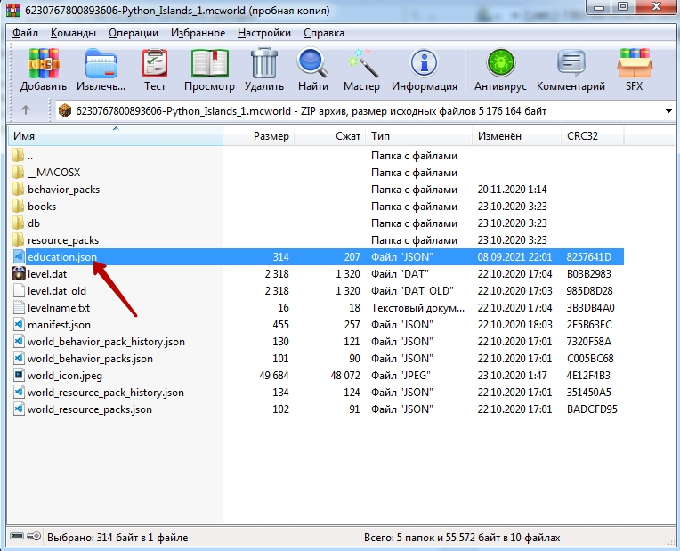
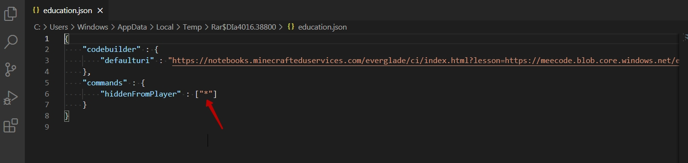
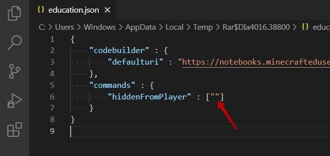
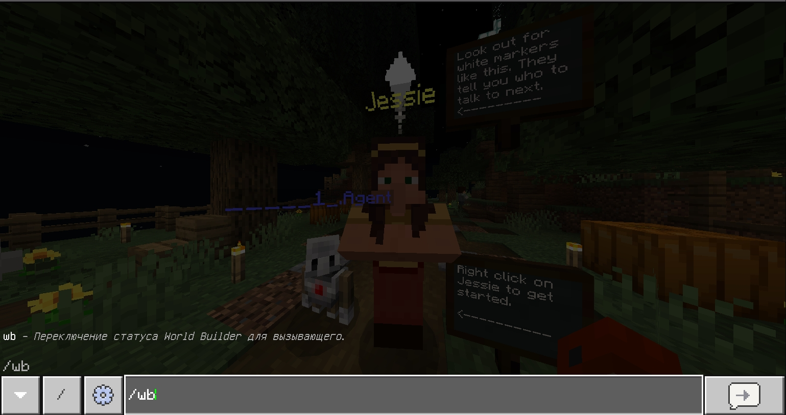

# Возможность редактировать мир.
Бывют миры, в которых нет возможности включить команду `/wb`

Это происходит из-за того что возможность доступа к командам отключена в настройках мира.  
Для того, чтобы включить данную возможность (пример, для мира <a href = "https://education.minecraft.net/ru-ru/lessons/island-1">Island-1</a>) необходимо изменить в настройках отключение команд.

**Зайти в файл education.json**  
  

Удалить звездочку в параметре "hiddenFromPlayer"  
  
В результате - будет отключена блокировка ввода команд.  
  
И появится возможность вводить команды в мире  
  

